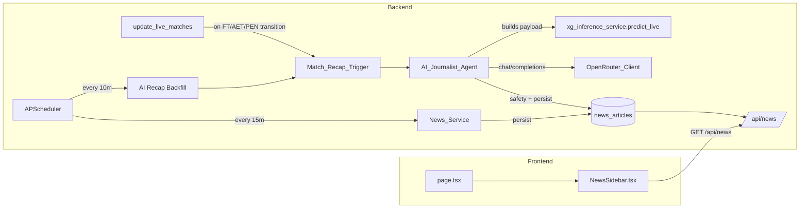
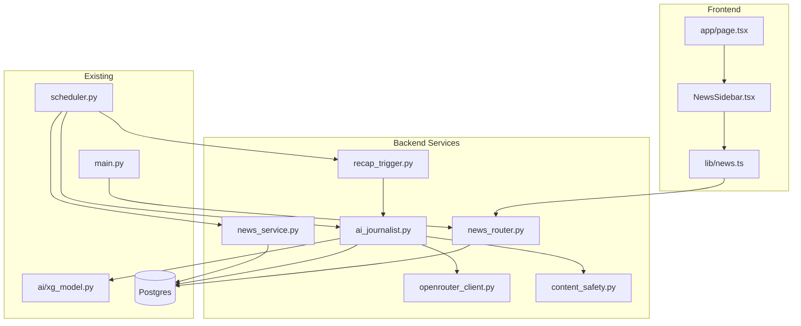

# Design Document

## Overview

The News Ecosystem extends the existing TerraBall Football Hub with an HLTV-style news experience. Two ingestion pipelines feed a single, persisted timeline of `NewsArticle` rows:

1. An **RSS aggregator** (`backend/services/news_service.py`) that polls public sports feeds (Sky Sports, BBC Football) every 15 minutes via APScheduler and persists deduplicated entries.
2. An **AI Match Journalist Agent** (`backend/services/ai_journalist.py`) that, when a match transitions to a finished status (`FT`, `AET`, `PEN`), gathers match data + live xG output and asks an OpenRouter chat-completions model (default `openai/gpt-4o-mini`) for a 100–150 word recap.

A unified, cursor-paginated FastAPI endpoint (`GET /api/news`) returns both article types ordered by `published_at` descending, with HTTP caching (`Cache-Control` + `ETag`/`If-None-Match`). A Next.js `NewsSidebar` component fetches that endpoint, renders a fixed 360 px sidebar on viewports ≥ 1280 px, displays a `🤖 AI Match Recap` badge for AI-authored items, supports keyboard/screen-reader access, and paginates via `next_cursor` on scroll.

The design integrates with existing infrastructure:
- `backend/scheduler.py` (APScheduler) — registers two new jobs: `news_rss_refresh` (15 min) and `ai_recap_backfill` (10 min).
- `backend/models.py` (SQLAlchemy + Postgres) — adds `news_articles` and `ai_recap_attempts` tables.
- `backend/ai/xg_model.py` (`xg_inference_service.predict_live`) — provides xG narrative for AI recaps.
- `backend/main.py` — registers the new `news_router`.
- `frontend/src/app/page.tsx` — wraps existing main content in a two-column flex layout to host the sidebar.

### Research Notes

**`feedparser` semantics.** The `feedparser` library exposes parsed entries with attributes `title`, `link`, `summary`, `published_parsed` (a `time.struct_time` in UTC) and `id`/`guid`. It tolerates malformed feeds without raising, instead exposing `feed.bozo` and `feed.bozo_exception`; the design treats `bozo=True` as a warning when at least one valid entry is parsed, otherwise as an error. ([feedparser docs — Common RSS elements](https://feedparser.readthedocs.io/en/latest/common-rss-elements.html))

**OpenRouter API shape.** OpenRouter exposes an OpenAI-compatible chat completions endpoint at `https://openrouter.ai/api/v1/chat/completions`. Authentication is `Authorization: Bearer <OPENROUTER_API_KEY>`. The body accepts `model`, `messages` (array of `{role, content}`), `temperature`, `max_tokens`, and returns `choices[0].message.content` plus a `usage` object (`prompt_tokens`, `completion_tokens`, `total_tokens`). ([OpenRouter — Quick Start](https://openrouter.ai/docs/quick-start))

**Public RSS feeds.** Sky Sports football feed: `https://www.skysports.com/rss/12040`. BBC Football feed: `https://feeds.bbci.co.uk/sport/football/rss.xml`. Both are RSS 2.0 with `<item>` elements containing `title`, `link`, `description`, `pubDate`, `guid`. BBC items occasionally include `<media:thumbnail>`; Sky items use `<enclosure>` for images.

**APScheduler patterns.** The existing `scheduler.py` uses `IntervalTrigger` with `replace_existing=True` and `next_run_time=now` to run a job at startup. The same pattern is reused for the RSS refresh and recap backfill jobs.

**xG service contract.** `xg_inference_service.predict_live(db, match)` returns a dict with `home_current_xg`, `away_current_xg`, `disclaimers: List[str]`. For finished matches, the returned values represent the full-time live xG estimate. The AI journalist consumes these directly and degrades gracefully when the call raises.

## Architecture

### High-Level Flow



### Process Boundaries

- **Single FastAPI process** hosts the API, the APScheduler `BackgroundScheduler`, and the AI journalist worker. The `BackgroundScheduler` runs jobs in worker threads, so OpenRouter HTTP calls do not block the FastAPI event loop.
- **Database** is the existing Postgres instance accessed through `SessionLocal`. All new tables share that connection pool.
- **External services**:
  - Public RSS feeds (HTTP GET via `feedparser`).
  - OpenRouter chat-completions (HTTPS POST).
  - No webhook callbacks; everything is poll-based.

### Trigger Strategy for AI Recaps

There are two paths to enqueue a finished match for the AI journalist, both routed through the same `Match_Recap_Trigger` function and made idempotent at the database layer:

1. **Real-time edge detection.** `scheduler._sync_competition_matches` already detects `status` changes per match. A small extension records the previous status; when the previous status was not in `{FT, AET, PEN}` and the new one is, the trigger is invoked synchronously after `db.commit()`.
2. **Backfill.** Every 10 minutes a job `ai_recap_backfill` selects matches where `status IN ('FT','AET','PEN')` and no `ai_recap` `News_Article` exists, then enqueues each one. This recovers from missed transitions (e.g., process restart, transient OpenRouter outage).

Both paths converge on a single function `enqueue_recap(match_id)` that performs the existence + attempt-counter checks before doing any external work.

### Concurrency and Idempotency

- The unique constraints `(source_type, external_id)` and the partial unique constraint on `match_id` for `source_type='ai_recap'` are the source of truth for idempotency. Two parallel ingestions racing to insert the same article cannot both succeed.
- Insert failures from `IntegrityError` are caught, logged at `WARNING`, and processing continues — never raising.
- The Recap_Attempt_Counter (a row in `ai_recap_attempts`) gates retries via exponential backoff and a hard cap of 5 attempts (Requirement 7.6, 7.7).

### Configuration Loading

All configuration is read once at module import via `python-dotenv` (already in `requirements.txt`) and validated with safe defaults. Invalid integer values for `NEWS_AI_DAILY_BUDGET` log an `ERROR` and fall back to 200 (Requirement 13.4). The `OPENROUTER_API_KEY` is masked as `"***"` in any log line that references the OpenRouter configuration (Requirement 13.3).

### Caching and ETag

`GET /api/news` returns a stable response shape ordered by `(published_at DESC, id DESC)`. The `ETag` value is computed as `W/"<max_published_at_iso>:<first_id>"`. Clients sending a matching `If-None-Match` receive `304 Not Modified` with no body. The `Cache-Control: public, max-age=30, stale-while-revalidate=60` header lets browsers and any intermediate cache layer reuse the response for 30 seconds while revalidating in the background.

## Components and Interfaces

### Backend

#### `backend/services/news_service.py`

```python
def fetch_and_store_rss_articles(db: Session) -> RssIngestionReport: ...

def parse_feed(feed_url: str, raw_bytes: bytes) -> list[ParsedRssEntry]: ...

def upsert_rss_article(db: Session, entry: ParsedRssEntry) -> NewsArticle | None: ...
```

- `fetch_and_store_rss_articles` is the entry point invoked by the scheduler. It iterates each `RSS_Feed_Source`, calls `feedparser.parse(url, request_headers={...})` with a 10-second socket timeout (`socket.setdefaulttimeout` is unsuitable in a multi-threaded scheduler; the implementation uses `requests.get(url, timeout=10)` and feeds the bytes to `feedparser.parse`).
- Per-feed exceptions are caught and logged at `ERROR` so a single failing feed does not abort the run.
- `parse_feed` normalizes published timestamps to UTC, maps `guid` → `external_id`, and falls back to `link` when `guid` is missing.
- `upsert_rss_article` issues an `INSERT … ON CONFLICT DO NOTHING` (or catches `IntegrityError` and rolls back the savepoint) on the `(source_type, external_id)` unique constraint.

#### `backend/services/openrouter_client.py`

```python
class ConfigurationError(RuntimeError): ...
class OpenRouterError(RuntimeError):
    status_code: int | None
    body_excerpt: str

def call_openrouter_chat(
    messages: list[dict],
    *,
    model: str,
    api_key: str,
    temperature: float = 0.6,
    max_tokens: int = 400,
    timeout_seconds: float = 30.0,
) -> OpenRouterResponse: ...
```

`OpenRouterResponse` exposes `content: str`, `usage: dict | None`. Non-2xx responses raise `OpenRouterError` containing the status code and the first 500 characters of the body. A missing `choices[0].message.content` field also raises `OpenRouterError`. Missing `OPENROUTER_API_KEY` raises `ConfigurationError` before any network call.

#### `backend/services/ai_journalist.py`

```python
def enqueue_recap(match_id: int, *, reason: str) -> None: ...

def generate_recap_for_match(db: Session, match: Match) -> NewsArticle | None: ...

def _build_recap_payload(db: Session, match: Match) -> RecapPayload: ...

def _is_within_daily_budget(db: Session) -> bool: ...

def _next_attempt_due(db: Session, match_id: int) -> datetime | None: ...
```

- `generate_recap_for_match` is the single point of entry that:
  1. Returns immediately if a `News_Article` with `source_type='ai_recap'` and `match_id=match.id` already exists.
  2. Returns immediately if `OPENROUTER_API_KEY` is unset (logs one `WARNING` per scheduler tick via a tick-scoped `set` in the calling function).
  3. Returns immediately if the daily budget is exhausted (logs one `WARNING` per scheduler tick).
  4. Returns immediately if the Recap_Attempt_Counter ≥ 5 (logs one `ERROR`, then no further calls for that match_id).
  5. Returns immediately if the next scheduled attempt time has not been reached (exponential backoff).
  6. Builds the `RecapPayload` (truncating goalscorers to 20 and stats to 25 entries).
  7. Calls `OpenRouter_Client.call_openrouter_chat`. On `OpenRouterError`, increments the attempt counter, schedules the next attempt at `now + min(2^N, 60) minutes`, logs the error, returns `None`.
  8. Runs the `Content_Safety_Filter`. On rejection, increments the attempt counter, logs a `WARNING`, returns `None`.
  9. Persists the `News_Article` row and logs the `usage` object as a single `INFO`.

#### `backend/services/content_safety.py`

```python
class SafetyRejection(Exception):
    reason: str

def validate_recap_text(text: str, *, deny_patterns: list[str]) -> str: ...
```

`validate_recap_text` enforces (Requirements 9.1–9.3, 9.5):
- Word count between 50 and 300 (uses `re.findall(r"\S+", text)`).
- No URL substring match (regex `https?://`).
- No HTML tags (regex `<[^>]+>`).
- No Markdown image syntax (regex `!\[[^\]]*\]\([^)]+\)`).
- No deny-listed substrings (case-insensitive `in` check).
- Returns the cleaned text: `strip()` + collapse runs of 3+ whitespace characters to a single space.

#### `backend/services/recap_trigger.py`

```python
FINISHED_STATUSES = {"FT", "AET", "PEN"}

def is_transition_to_finished(prev_status: str | None, new_status: str | None) -> bool:
    return new_status in FINISHED_STATUSES and prev_status not in FINISHED_STATUSES
```

The existing `_sync_competition_matches` is patched to capture the previous status before mutation and call `recap_trigger.handle_status_change(match_id, prev_status, new_status)` after `db.commit()`. The handler enqueues to a thread pool that calls `generate_recap_for_match` so that the scheduler thread is not blocked by OpenRouter latency.

#### `backend/routers/news_router.py`

```python
router = APIRouter(prefix="/api/news", tags=["news"])

@router.get("", response_model=NewsListResponse)
def list_news(
    request: Request,
    response: Response,
    limit: int = Query(50, ge=1, le=100),
    cursor: str | None = Query(None),
    db: Session = Depends(get_db),
) -> NewsListResponse: ...
```

The handler:
1. Validates `cursor` as ISO-8601 (returns 422 on failure, identifying `cursor`).
2. Builds the SQLAlchemy query: `NewsArticle` ordered by `(published_at desc, id desc)`, with `published_at < cursor` when cursor is provided, limited to `limit + 0` rows (we use `limit` exactly and base `next_cursor` on whether the result count equals `limit`).
3. Computes the `ETag` from the first row (or a constant `W/"empty"` for empty results).
4. Compares with `If-None-Match`; on match, returns `Response(status_code=304)` with `ETag` and `Cache-Control` headers, no body.
5. Otherwise sets `Cache-Control: public, max-age=30, stale-while-revalidate=60` and `ETag`, then returns the serialized list. For `ai_recap` rows, `url` is set to `null` and `match_id` to the article's `match_id`.

The router is added to `backend/main.py` alongside existing routers.

#### `backend/scheduler.py` extensions

Two jobs are appended in `start_scheduler()`:

```python
scheduler.add_job(
    fetch_and_store_rss_articles_job,
    trigger=IntervalTrigger(minutes=15),
    id='news_rss_refresh',
    name='News RSS Refresh',
    replace_existing=True,
    next_run_time=datetime.datetime.now(tz=pytz.UTC),
)

scheduler.add_job(
    ai_recap_backfill_job,
    trigger=IntervalTrigger(minutes=10),
    id='ai_recap_backfill',
    name='AI Recap Backfill',
    replace_existing=True,
)
```

Both jobs open their own `SessionLocal()`, wrap the body in `try/except` that logs at `ERROR`, and always close the session in `finally`.

### Frontend

#### `frontend/src/lib/news.ts`

```ts
export type NewsSourceType = 'rss' | 'ai_recap';

export interface NewsArticle {
  id: number;
  source_type: NewsSourceType;
  source_name: string;
  title: string;
  summary: string;
  url: string | null;
  image_url: string | null;
  published_at: string; // ISO-8601 UTC
  match_id: number | null;
}

export interface NewsListResponse {
  items: NewsArticle[];
  next_cursor: string | null;
}

export async function fetchNews(params: {
  limit?: number;
  cursor?: string | null;
  signal?: AbortSignal;
}): Promise<NewsListResponse> { ... }
```

The implementation uses `fetch` against `${process.env.NEXT_PUBLIC_API_BASE_URL}/api/news` with `cache: 'no-store'` (the browser cache layer is governed by the response `Cache-Control` header).

#### `frontend/src/components/news/NewsSidebar.tsx`

A client component (`'use client'`) that:

- Renders a `<aside role="complementary" aria-label="Football news">` with Tailwind classes that hide the element below `xl` (`hidden xl:block w-[360px]`) and stick it to the right of the main content (`sticky top-0 h-screen overflow-y-auto`).
- Uses `useQuery` (TanStack Query is already a dependency) for the initial fetch and `useInfiniteQuery` for cursor pagination. The `enabled` flag is gated behind a `useMediaQuery('(min-width: 1280px)')` hook so the network call is only made when the sidebar will render.
- Refetches every 60 seconds via `refetchInterval: 60_000`.
- Renders a loading skeleton (existing `components/ui/skeleton.tsx`) on the initial load.
- Renders an error state (`"News unavailable"` + retry button) when the latest query has `status === 'error'` or returns a non-2xx response. The retry button calls `refetch()` and is operable with both Enter and Space (the default `<button>` already handles Space; Enter is handled because the element is in the DOM tab order).
- For each `NewsArticle`:
  - **`rss`**: renders an `<a href={url} target="_blank" rel="noopener noreferrer">` wrapping the title and (when `image_url` is present) an ``.
  - **`ai_recap`**: renders a `<Link href={`/match/${match_id}`}>` with the `🤖 AI Match Recap` badge.
- Deduplicates appended pages by `id` with a `Map<number, NewsArticle>` before rendering.
- Detects "near the bottom" by attaching a `scroll` listener on the sidebar container and checking `el.scrollHeight - el.scrollTop - el.clientHeight < 200`.

#### `frontend/src/app/page.tsx` integration

The existing `<main>` content is wrapped in a flex container at the `xl` breakpoint:

```tsx
<div className="xl:flex xl:gap-6 xl:items-start">
  <div className="flex-1 min-w-0">{/* existing main content */}</div>
  <NewsSidebar />
</div>
```

On viewports below 1280 px the sidebar collapses to `display: none` (Requirement 11.2) and the main content occupies the full width.

### Component Diagram



## Data Models

### `NewsArticle`

A single SQLAlchemy table backs both ingestion paths.

| Column | Type | Constraints | Purpose |
| --- | --- | --- | --- |
| `id` | `Integer` | PK, autoincrement | Stable surrogate key |
| `source_type` | `String(16)` | NOT NULL, CHECK (`source_type IN ('rss','ai_recap')`) | Discriminator (Req 1.7) |
| `source_name` | `String(128)` | NOT NULL | Human-readable origin (`"Sky Sports"`, `"BBC Football"`, `"TerraBall AI"`) |
| `title` | `String(512)` | NOT NULL | Headline |
| `summary` | `Text` | NOT NULL | Body copy (RSS summary or AI recap content) |
| `url` | `String(1024)` | NULLABLE | External RSS link; NULL for AI recaps (Req 10.9) |
| `image_url` | `String(1024)` | NULLABLE | First enclosure or media-thumbnail URL |
| `published_at` | `DateTime(timezone=False)` | NOT NULL, indexed | UTC timestamp used for ordering and cursor pagination |
| `external_id` | `String(512)` | NOT NULL | RSS guid/link or `"ai_recap:{match_id}"` |
| `match_id` | `Integer` | NULLABLE, FK → `matches.id` | Set only when `source_type='ai_recap'` |
| `created_at` | `DateTime` | NOT NULL, default `utcnow` | Insertion timestamp (Req 1.3) |

**Indexes and constraints**:

- `UniqueConstraint('source_type', 'external_id', name='uq_news_articles_source_external')` — Req 1.4.
- Partial unique index on `match_id` where `source_type='ai_recap'`, name `uq_news_articles_ai_recap_match`. Postgres syntax: `CREATE UNIQUE INDEX uq_news_articles_ai_recap_match ON news_articles (match_id) WHERE source_type = 'ai_recap';` — Req 1.5.
- Composite index `(published_at DESC, id DESC)` named `ix_news_articles_published_at_id` to support the API query pattern.
- CHECK constraint `ck_news_articles_source_type` enforcing the `source_type` enumeration — Req 1.7.

### `AIRecapAttempt`

Tracks per-match attempt count and the next allowed attempt time. Kept in a sibling table (rather than as columns on `news_articles`) because attempts may exist before any article does, and may be retained for diagnostic purposes after a successful recap.

| Column | Type | Constraints | Purpose |
| --- | --- | --- | --- |
| `id` | `Integer` | PK | |
| `match_id` | `Integer` | NOT NULL, UNIQUE, FK → `matches.id` | One attempt row per match |
| `attempt_count` | `Integer` | NOT NULL, default `0` | Recap_Attempt_Counter (Req 7.4, 7.6) |
| `last_attempt_at` | `DateTime` | NULLABLE | Timestamp of most recent attempt |
| `next_attempt_after` | `DateTime` | NULLABLE | Earliest time the next attempt may be made (exponential backoff, Req 7.7) |
| `last_error` | `String(512)` | NULLABLE | Last failure reason for diagnostics |
| `abandoned` | `Boolean` | NOT NULL, default `False` | Set when `attempt_count >= 5` (Req 7.6) |

### `RecapPayload` (in-memory dataclass)

Not persisted; serialized to JSON for the OpenRouter user message.

```python
@dataclass
class RecapPayload:
    match_id: int
    home_team_name: str
    away_team_name: str
    home_score: int
    away_score: int
    competition_name: str
    kickoff_utc: str  # ISO-8601 UTC
    goalscorers: list[Goalscorer]  # at most 20
    match_statistics: dict[str, int | float]  # at most 25 keys
    xg_home: float | None
    xg_away: float | None
    xg_disclaimers: list[str]
```

### Pydantic Schemas (in `backend/schemas.py`)

```python
class NewsArticleOut(BaseModel):
    id: int
    source_type: Literal["rss", "ai_recap"]
    source_name: str
    title: str
    summary: str
    url: str | None
    image_url: str | None
    published_at: datetime
    match_id: int | None

class NewsListResponse(BaseModel):
    items: list[NewsArticleOut]
    next_cursor: str | None
```

### Database Migration

A new file `backend/migrate_news_ecosystem.py` will follow the existing migration script pattern (raw SQL via `engine.begin()`), creating both tables, the partial unique index, and the composite index. Idempotent: each `CREATE` statement uses `IF NOT EXISTS`.


## Correctness Properties

*A property is a characteristic or behavior that should hold true across all valid executions of a system — essentially, a formal statement about what the system should do. Properties serve as the bridge between human-readable specifications and machine-verifiable correctness guarantees.*

The News Ecosystem is well-suited to property-based testing: the RSS aggregator, AI journalist agent, content safety filter, attempt scheduler, and `/api/news` query are pure or near-pure functions over well-defined inputs (entries, payloads, text, DB state). UI rendering rules (badges, link targets, alt text) are deterministic functions over the article shape and are testable as properties using the existing `@testing-library/react` + `vitest` stack. Visual contrast and skeleton presence are validated as smoke/example tests instead.

Properties below were derived from the prework analysis and consolidated to remove redundancy.

### Property 1: RSS ingestion is idempotent and never raises

*For any* sequence of `ParsedRssEntry` values and any number `K ≥ 1` of repeated ingestions of the same entry, the `news_articles` table contains exactly one row per distinct `external_id`, and `fetch_and_store_rss_articles` returns normally even when individual feeds raise.

**Validates: Requirements 1.4, 1.6, 2.8**

### Property 2: RSS entry to NewsArticle mapping preserves all extracted fields and skip rules

*For any* set of parsed RSS entries with arbitrary combinations of present/missing `title`, `link`, `guid`, `summary`, `published`, and image fields, ingestion produces a row for every entry that has both `title` and `link` (and only those entries), with `external_id` equal to `guid` when present and `link` otherwise, `published_at` set to the parsed UTC timestamp or to the current UTC instant when `published` is absent, and `created_at` set to the current UTC instant.

**Validates: Requirements 1.1, 1.3, 2.4, 2.5, 2.6, 2.7, 2.9**

### Property 3: Comma-separated env list parsing is a round-trip

*For any* list `L` of non-empty trimmed URL-like strings, parsing the comma-joined representation of `L` returns exactly `L`; for empty or unset input, parsing returns the configured default list.

**Validates: Requirements 2.1, 2.2 (default fallback)**

### Property 4: Recap trigger fires exactly when status crosses into a finished state and no recap exists

*For any* pair `(prev_status, new_status)` and any database state, `Match_Recap_Trigger` enqueues the match if and only if `new_status ∈ {FT, AET, PEN}`, `prev_status ∉ {FT, AET, PEN}`, and no `News_Article` with `source_type='ai_recap'` and the same `match_id` already exists.

**Validates: Requirements 4.1, 4.2, 4.3**

### Property 5: RecapPayload reflects database state and xG service outcome

*For any* finished `Match` together with its associated `MatchEvent` and optional `MatchStatistics` rows, and any xG service outcome (success returning a value or raising), `_build_recap_payload` produces a payload whose `goalscorers` is exactly the goal-typed events for the match ordered by ascending minute, whose `match_statistics` reflects the `MatchStatistics` row when present and equals `{}` when absent, whose `xg_home`/`xg_away` equal the values returned by the service on success and are `null` on failure, and whose `xg_disclaimers` contains `"xG unavailable"` if and only if the service failed.

**Validates: Requirements 5.1, 5.2, 5.3, 5.4, 5.5, 5.6**

### Property 6: OpenRouter request body shape and payload bounds

*For any* `RecapPayload`, the HTTP request issued by `OpenRouter_Client.call_openrouter_chat` POSTs to `https://openrouter.ai/api/v1/chat/completions`, includes the header `Authorization: Bearer <api_key>`, has JSON body fields `model`, `temperature=0.6`, `max_tokens=400`, and a `messages` array whose user-role content JSON-parses back to a payload equal to the input payload, with `goalscorers` truncated to at most 20 entries and `match_statistics` truncated to at most 25 key-value pairs.

**Validates: Requirements 6.3, 6.5, 8.4, 8.5**

### Property 7: OpenRouter error mapping for non-2xx and malformed responses

*For any* HTTP response with status code outside `[200, 299]` or any 2xx response missing the `choices[0].message.content` field, `OpenRouter_Client.call_openrouter_chat` raises `OpenRouterError` whose attached `status_code` matches the response status (or is `None` for malformed-shape errors) and whose `body_excerpt` is a prefix of the response body of length at most 500 characters.

**Validates: Requirements 6.7, 6.8**

### Property 8: AI recap persistence is idempotent and respects failure side-effects

*For any* sequence of `generate_recap_for_match` invocations for a given finished match against a mocked OpenRouter, exactly one `News_Article` with `source_type='ai_recap'` and `match_id=match.id` exists at the end if at least one invocation succeeded; OpenRouter is contacted at most once across the whole sequence after success; on each `OpenRouterError` or safety-filter rejection, no `News_Article` row is created and the `AIRecapAttempt.attempt_count` for that match is incremented by exactly 1.

**Validates: Requirements 1.2, 1.5, 7.1, 7.2, 7.4, 7.5, 9.4**

### Property 9: Attempt counter, abandonment, and exponential backoff

*For any* `AIRecapAttempt` row with `attempt_count = N` and `last_attempt_at = T`, the agent invokes OpenRouter only when `now ≥ T + min(2^N, 60) minutes`; on failure the new `next_attempt_after` equals `now + min(2^(N+1), 60) minutes`; whenever `attempt_count ≥ 5`, the agent skips the OpenRouter call entirely, logs exactly one `ERROR`, and sets `abandoned=True`.

**Validates: Requirements 7.6, 7.7**

### Property 10: Daily budget gate

*For any* database state of `News_Article` rows and any positive integer budget `B`, `generate_recap_for_match` invokes OpenRouter if and only if the count of `News_Article` rows with `source_type='ai_recap'` and `created_at` within the current UTC calendar day is strictly less than `B`; when the budget is exhausted, no OpenRouter call is made and exactly one `WARNING` is emitted per scheduler tick regardless of how many matches are processed.

**Validates: Requirements 8.2, 8.3, 13.2**

### Property 11: Content safety filter is sound and idempotent on accepted text

*For any* candidate text and any deny-list, `validate_recap_text` raises `SafetyRejection` if and only if the text has a word count outside `[50, 300]`, contains a substring matching `https?://`, contains an HTML tag (regex `<[^>]+>`), contains Markdown image syntax (regex `!\[[^\]]*\]\([^)]+\)`), or contains any deny-list substring case-insensitively; for any accepted text, the returned text equals `text.strip()` with internal runs of three or more whitespace characters collapsed to a single space, and applying `validate_recap_text` to that returned text yields the same text unchanged.

**Validates: Requirements 9.1, 9.2, 9.3, 9.5**

### Property 12: `/api/news` pagination invariants

*For any* set of `News_Article` rows, any `limit ∈ [1, 100]`, and any optional ISO-8601 `cursor`, `GET /api/news` returns at most `limit` items, all having `published_at < cursor` when cursor is provided, sorted by `(published_at DESC, id DESC)`; `next_cursor` equals the `published_at` of the last returned item when the response contains exactly `limit` items and is `null` otherwise; iteratively following `next_cursor` until it is `null` yields the complete set of articles satisfying the cursor predicate, each appearing exactly once.

**Validates: Requirements 10.2, 10.3, 10.4, 10.5**

### Property 13: `/api/news` response schema and AI recap field mapping

*For any* `News_Article` row, the corresponding API item contains the keys `id`, `source_type`, `source_name`, `title`, `summary`, `url`, `image_url`, `published_at`, `match_id`; for items with `source_type='ai_recap'`, `url` is `null` and `match_id` equals the row's `match_id`; for items with `source_type='rss'`, `match_id` is `null`.

**Validates: Requirements 10.8, 10.9**

### Property 14: `/api/news` query parameter validation

*For any* `limit` outside `[1, 100]` or any `cursor` that does not parse as an ISO-8601 timestamp, `GET /api/news` responds with HTTP `422` whose error body identifies the offending parameter name, and never reaches the database query layer.

**Validates: Requirements 10.6, 10.7**

### Property 15: `/api/news` ETag and conditional GET

*For any* article-set `S`, the `ETag` returned by `GET /api/news` is a deterministic function of `S` (specifically of the maximum `published_at` and the `id` of the first item under the canonical ordering); two requests against the same `S` return identical `ETag` values; a request whose `If-None-Match` header equals the current `ETag` returns HTTP `304` with no body and the same `ETag` and `Cache-Control` headers as the corresponding `200` response.

**Validates: Requirements 10.11, 10.12**

### Property 16: NewsSidebar per-item rendering contract

*For any* list of `NewsArticle` items, the rendered sidebar contains, in document order, exactly one rendered element per input item such that:

- items with `source_type='ai_recap'` include a badge whose accessible name is `"AI generated match recap"` and visible text containing `"AI Match Recap"`, and a hyperlink whose `href` equals `/match/{match_id}`;
- items with `source_type='rss'` render a hyperlink whose `href` equals the item's `url`, with attributes `target="_blank"` and `rel="noopener noreferrer"`;
- items with a non-null `image_url` render an `` whose `alt` attribute equals the item's `title`.

**Validates: Requirements 11.5, 11.6, 11.7, 12.8**

### Property 17: NewsSidebar pagination and deduplication

*For any* sequence of paginated `NewsListResponse` payloads (possibly with overlapping `id` values across pages) returned during scroll-driven pagination, the rendered sidebar list contains each `id` at most once and equals the order-preserving deduplicated concatenation of the fetched pages.

**Validates: Requirements 11.11, 11.12**

### Property 18: API key redaction in logs

*For any* OpenRouter API key value, no log record produced by the OpenRouter client or AI journalist agent contains the literal API key value; whenever a log record references the OpenRouter configuration, it includes the redacted token `"***"` in the position of the API key value.

**Validates: Requirements 13.3**

### Property 19: NEWS_AI_DAILY_BUDGET parses with safe fallback

*For any* environment value, the effective daily budget equals the parsed positive integer when the value is a valid positive integer string, and equals 200 in all other cases (unset, empty, non-numeric, zero, negative, fractional); whenever the fallback is taken because of a malformed value, exactly one `ERROR` log line is emitted at startup.

**Validates: Requirements 13.4**

## Error Handling

The system distinguishes recoverable per-item errors from unrecoverable configuration errors and applies bounded retries to external dependencies.

### Error Categories

| Category | Examples | Strategy |
| --- | --- | --- |
| Configuration | Missing `OPENROUTER_API_KEY`; unparseable `NEWS_AI_DAILY_BUDGET` | Log once, fall back to safe default (skip recap generation; budget = 200). Never raise to the scheduler. |
| Per-feed transient | Network timeout, DNS failure, malformed feed XML | Catch in the per-feed loop, log at `ERROR`, continue to the next feed. |
| Per-entry validation | Missing `title`/`link` on an RSS entry | Log a `WARNING` with the feed URL, skip the entry, continue. |
| Database integrity | Unique constraint violation on `(source_type, external_id)` or `(match_id) WHERE source_type='ai_recap'` | Catch `IntegrityError`, roll back the savepoint, log `WARNING`, continue. |
| OpenRouter transient | Network timeout, 5xx responses, 429 rate limit | Raise `OpenRouterError` from the client; the agent catches it, increments the attempt counter, schedules the next attempt with exponential backoff. |
| OpenRouter response shape | Missing `choices[0].message.content`, malformed JSON | Same handling as transient errors. |
| Content safety rejection | Length out of range, URL/HTML/markdown image, deny-list match | Discard response, increment attempt counter, log `WARNING`, retry on next eligible tick. |
| Hard failure | Recap_Attempt_Counter ≥ 5 | Set `abandoned=True`, log a single `ERROR`, never retry that match again. |

### Logging and Redaction

- All log lines that reference OpenRouter configuration or the OpenRouter request emit the API key as the literal string `"***"` (Property 18).
- Token usage is logged at `INFO` exactly once per successful generation (Requirement 8.6).
- Daily budget exhaustion logs at `WARNING` exactly once per scheduler tick (Property 10).
- Missing `OPENROUTER_API_KEY` logs at `WARNING` exactly once per scheduler tick (Requirement 13.2).

### HTTP Error Mapping

`/api/news` validates input parameters via FastAPI's `Query` constraints (`ge`, `le`) and a custom dependency that parses `cursor` as ISO-8601. Validation errors return HTTP `422` with FastAPI's standard error body containing `loc=["query","limit"]` or `loc=["query","cursor"]` so the client can identify the offending parameter (Property 14). Any unexpected exception in the handler is caught by FastAPI's default 500 handler; the database session dependency ensures the connection is returned to the pool.

### Sidebar Error UI

When a `fetch` rejects or returns a non-2xx status, the sidebar renders `"News unavailable"` together with a retry button. The retry button calls the query's `refetch` and is operable with both Enter and Space (native `<button>` semantics, Requirement 12.7). The error UI never surfaces request internals (e.g., URL, status code) to the user; failures are reported to the browser console via `console.error` only.

## Testing Strategy

### Backend Test Layout

| Test File | Focus | Style |
| --- | --- | --- |
| `backend/tests/test_news_service_property.py` | RSS ingestion, parsing, idempotency | Property-based (Hypothesis) |
| `backend/tests/test_recap_trigger_property.py` | Status-transition trigger and backfill | Property-based (Hypothesis) |
| `backend/tests/test_ai_journalist_property.py` | Payload construction, persistence, attempt counter, budget | Property-based (Hypothesis) |
| `backend/tests/test_openrouter_client_property.py` | Request shape, error mapping | Property-based (Hypothesis) |
| `backend/tests/test_content_safety_property.py` | Accept/reject logic, normalization | Property-based (Hypothesis) |
| `backend/tests/test_news_router_property.py` | Pagination, schema, ETag | Property-based (Hypothesis) using FastAPI `TestClient` |
| `backend/tests/test_news_router_examples.py` | 422 error shape, headers, defaults | Example-based (pytest) |
| `backend/tests/test_news_smoke.py` | Scheduler job registration, env wiring | Smoke / example-based |

### Frontend Test Layout

| Test File | Focus | Style |
| --- | --- | --- |
| `frontend/src/components/news/NewsSidebar.test.tsx` | Item rendering contract, pagination, dedup, tab order | Property-based (`fast-check` + `@testing-library/react`) |
| `frontend/src/components/news/NewsSidebar.examples.test.tsx` | Loading skeleton, error state, retry, ARIA attributes, image alt fallback | Example-based (vitest + RTL) |

### Property-Based Testing Library Choices

- **Backend (Python):** [Hypothesis](https://hypothesis.readthedocs.io/) — already aligns with the existing `pytest`-based suite (`backend/test_*.py`). Each property test sets `@settings(max_examples=100)` (and higher for trivially-fast generators).
- **Frontend (TypeScript):** [`fast-check`](https://fast-check.dev/) integrated with the existing `vitest` runner. Each property test uses `fc.assert(prop, { numRuns: 100 })`.

### Property Test Configuration

- Every property test runs at least 100 iterations.
- Each property test is tagged with a comment referencing the design property in the format:
  `# Feature: news-ecosystem, Property {N}: {short property description}`
  (Python) or `// Feature: news-ecosystem, Property {N}: {short property description}` (TypeScript).
- Each correctness property in this design maps to **one** property test. Where a property is naturally split across backend and frontend boundaries (none in this design), the mapping is documented at the top of the relevant test file.

### Test Doubles and Fixtures

- **Database**: backend property tests use a function-scoped Postgres test database via the existing `database.py` configuration. Hypothesis strategies wrap a `db.begin_nested()` savepoint per example so each example runs against a clean database state.
- **`feedparser`**: parsing tests pass synthetic `ParsedRssEntry` dictionaries directly into `parse_feed`; integration with `feedparser` itself is verified by a small fixture-based example test that feeds real RSS XML samples (one Sky Sports, one BBC) checked into `backend/tests/fixtures/`.
- **OpenRouter client**: property tests monkeypatch `requests.post` (or the chosen HTTP client) to return synthetic responses; no real network calls.
- **xG service**: property tests monkeypatch `xg_inference_service.predict_live` with Hypothesis-controlled return values, including raising paths.
- **APScheduler**: scheduler-config tests build a `BackgroundScheduler` instance (without `start()`) and inspect `get_jobs()` to assert IDs and triggers.

### Unit Test Balance

- Property tests own the universal invariants listed above and cover the bulk of correctness.
- Example/smoke tests own:
  - exact strings (system prompt content, header values, default URL list),
  - HTTP status code mapping for malformed input,
  - APScheduler job registration,
  - real-RSS XML fixture parsing (anchor against feedparser's actual behavior),
  - accessibility ARIA attribute presence (axe-core `react-axe` rule run as part of `NewsSidebar.examples.test.tsx`).

### Visual / Accessibility Smoke Tests

- WCAG 2.1 AA contrast (Requirement 12.6) and visible focus ring (Requirement 12.5) are validated using `axe-core` rules `color-contrast` and `focus-visible` inside the example-based RTL test file. These run once per build and are marked SMOKE because contrast does not vary meaningfully with input.

### CI Gates

- Backend property suite runs as part of the existing `pytest` invocation; failure blocks merge.
- Frontend property suite runs via `vitest run` (already configured in `frontend/package.json`); failure blocks merge.
- A new `npm run test:axe` script wraps the axe-core smoke checks for the sidebar.
